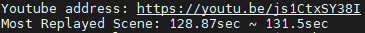

# crawl-most-replayed
**crawl "Most Replayed" metadata from Youtube**

**유투브 "가장 많이 다시 본 장면" 크롤링**

## Tutorial
```
git clone https://github.com/mallang327/crawl-most-replayed.git
cd crawl-most-replayed
python crawl_mostReplayed.py -i js1CtxSY38I -c [chromedriver_location]
```

## Crawling Result


## From Youtube


## Reference
Crawling by YouTube operational API

[(Github Link) YouTube-operational-API](https://github.com/Benjamin-Loison/YouTube-operational-API)
